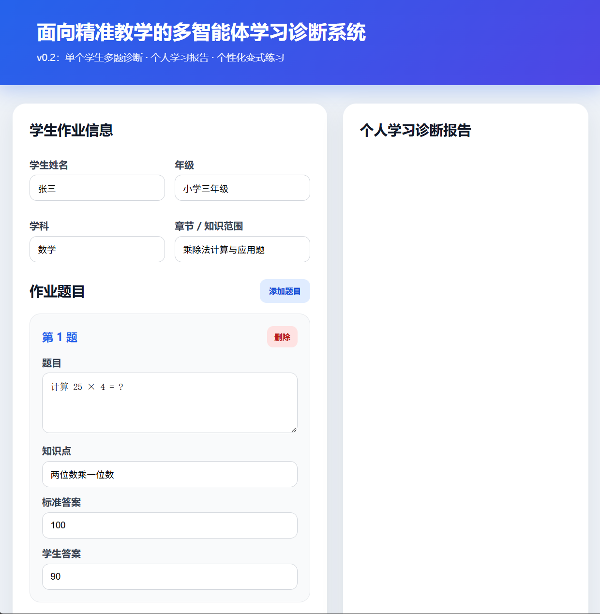

# AIGC Teaching Agent

这是一个基于 Flask 和 DeepSeek API 的多智能体学习诊断系统。

本项目面向中小学精准教学场景，围绕教师日常批改作业、分析错题、布置针对性练习等真实需求，构建了一个能够进行“逐题批改、错因诊断、个性化练习生成、个人学习报告生成”的 AI 教学辅助系统。

当前项目已经完成 v0.2 版本：支持输入单个学生的多道作业题目，系统会自动完成逐题批改、错误原因分析、薄弱知识点总结，并生成个人学习诊断报告和个性化变式练习。

---

## 功能

- Flask 后端服务
- DeepSeek API 调用
- 前端作业诊断页面
- 支持输入学生基本信息
- 支持输入多道作业题目
- 支持逐题智能批改
- 支持错因类型诊断
- 支持薄弱知识点分析
- 支持个人学习诊断报告生成
- 支持个性化变式练习生成
- 支持教师辅导建议生成
- 使用 `.env` 文件保护 API Key
- 使用 `requirements.txt` 管理项目依赖
- 使用 `.gitignore` 避免上传敏感信息和虚拟环境

---

## 项目背景

在传统教学场景中，老师批改作业通常存在以下问题：

1. 批改作业耗时长，重复劳动多。
2. 传统批改多为“对 / 错”反馈，学生不知道自己为什么错。
3. 学生订正错题时缺少针对性指导。
4. 老师难以及时判断学生薄弱知识点。
5. 统一布置作业难以满足不同学生的个性化补差需求。
6. 班级讲评主要依赖教师经验，缺少数据支撑。

本项目希望通过 AIGC 和多智能体协作方式，将传统作业批改升级为：

```text
作业输入
↓
逐题批改
↓
错因诊断
↓
薄弱知识点分析
↓
个性化变式练习
↓
个人学习诊断报告
```

从而帮助老师提升批改效率，也帮助学生更清楚地知道自己错在哪里、应该如何订正、后续应该练什么。

---

## 项目结构

```text
aigc-teaching-agent/
├── app.py
├── .env
├── .env.example
├── .gitignore
├── requirements.txt
├── README.md
├── agents/
│   ├── __init__.py
│   └── teaching_agents.py
├── static/
│   └── style.css
└── templates/
    └── index.html
```

说明：

| 文件或文件夹 | 作用 |
|---|---|
| `app.py` | Flask 后端主程序 |
| `agents/teaching_agents.py` | 多智能体核心逻辑 |
| `templates/index.html` | 前端页面 |
| `static/style.css` | 页面样式 |
| `requirements.txt` | Python 依赖列表 |
| `.env` | 本地 API Key 配置文件，不上传 GitHub |
| `.env.example` | 环境变量示例文件，可以上传 GitHub |
| `.gitignore` | Git 忽略配置 |
| `README.md` | 项目说明文档 |

---

## 环境要求

- Python 3.10+
- VSCode
- Flask
- DeepSeek API Key
- Git
- GitHub 账号

---

## 安装与运行

### 1. 克隆项目

```bash
git clone https://github.com/songzhiwei1106/aigc-teaching-agent.git
cd aigc-teaching-agent
```

---

### 2. 创建虚拟环境

Windows PowerShell：

```bash
python -m venv .venv
```

---

### 3. 激活虚拟环境

Windows PowerShell：

```bash
.\.venv\Scripts\Activate.ps1
```

如果是 CMD：

```bash
.venv\Scripts\activate
```

---

### 4. 安装依赖

```bash
pip install -r requirements.txt
```

如果网络连接 PyPI 有问题，可以使用国内镜像：

```bash
pip install -r requirements.txt -i http://mirrors.aliyun.com/pypi/simple/ --trusted-host mirrors.aliyun.com
```

---

### 5. 创建 `.env` 文件

在项目根目录下创建 `.env` 文件，并写入：

```env
DEEPSEEK_API_KEY=你的DeepSeek API Key
```

注意：

不要把真实 API Key 上传到 GitHub。

本项目已经通过 `.gitignore` 忽略 `.env` 文件。

---

### 6. 启动项目

```bash
python app.py
```

---

### 7. 浏览器访问

```text
http://127.0.0.1:5000
```

打开后即可看到多智能体学习诊断系统页面。

---

## `.gitignore` 内容

```gitignore
# Python
__pycache__/
*.pyc
*.pyo
*.pyd

# Virtual environment
.venv/
venv/

# Environment variables
.env

# Flask
instance/
.webassets-cache

# VSCode
.vscode/

# System
.DS_Store
Thumbs.db
```

---

## 技术栈

- Python
- Flask
- HTML
- CSS
- JavaScript
- DeepSeek API
- requests
- python-dotenv
- Git
- GitHub

---

## 多智能体设计

本项目不是普通的 AI 聊天机器人，而是将教学任务拆分为多个智能体协作完成。

当前版本主要包含以下智能体：

### 1. 逐题批改与错因诊断智能体

负责对学生的每一道题进行批改，并判断：

- 是否正确
- 得分情况
- 批改原因
- 错误类型
- 错误位置
- 薄弱知识点
- 订正建议

---

### 2. 个性化变式练习智能体

负责根据学生的错题和薄弱知识点，生成针对性的变式练习。

练习题按照难度递进：

```text
基础题 → 巩固题 → 提升题
```

每道练习题包含：

- 难度
- 针对知识点
- 题目内容
- 标准答案
- 设计意图

---

### 3. 个人学习报告智能体

负责整合逐题批改结果和变式练习，生成学生个人学习诊断报告。

报告内容包括：

- 总体学习表现
- 正确题数
- 正确率
- 主要错误类型
- 薄弱知识点
- 学习建议
- 教师辅导建议
- 给学生的鼓励性反馈

---

### 4. 总控智能体

负责协调不同智能体的执行顺序，完成完整诊断流程：

```text
学生作业数据
↓
逐题批改与错因诊断智能体
↓
个性化变式练习智能体
↓
个人学习报告智能体
↓
输出完整学习诊断报告
```

---

## 当前版本

### v0.2 单个学生多题诊断报告版

当前项目已从 v0.1 的“单题诊断”升级为 v0.2 的“单个学生多题诊断报告”。

用户可以输入一个学生的多道题目，系统会调用 DeepSeek API，并通过多智能体协作完成批改、诊断、练习生成和报告整理。

---

## 已完成

- Flask 后端项目搭建
- DeepSeek API 接入
- 前端页面搭建
- 页面样式美化
- 多智能体模块拆分
- 单题智能诊断
- 单个学生多题输入
- 逐题智能批改
- 错因类型判断
- 薄弱知识点分析
- 订正建议生成
- 个性化变式练习生成
- 个人学习诊断报告生成
- 教师辅导建议生成
- `.env` 管理 API Key
- `.gitignore` 忽略敏感文件
- GitHub 仓库上传

---

## 当前演示数据

系统默认提供 3 道示例题：

```text
第 1 题：
计算 25 × 4 = ?
知识点：两位数乘一位数
标准答案：100
学生答案：90

第 2 题：
计算 36 ÷ 6 = ?
知识点：表内除法
标准答案：6
学生答案：6

第 3 题：
小明有 12 个苹果，平均分给 3 个同学，每个同学分到几个苹果？
知识点：平均分应用题
标准答案：4
学生答案：3
```

点击页面中的“生成个人诊断报告”按钮后，系统会自动输出：

- 学生基本信息
- 总体学习表现
- 逐题批改与错因诊断
- 个性化变式练习
- 学习建议
- 教师辅导建议
- 给学生的反馈

---

## 错因类型

当前系统支持以下错误类型：

| 错误类型 | 说明 |
|---|---|
| 知识点漏洞 | 学生没有掌握相关知识点 |
| 计算失误 | 方法可能正确，但计算过程出错 |
| 审题不清 | 没有正确理解题目条件或问题 |
| 表达不规范 | 答案格式、单位或步骤表达不完整 |
| 无明显错误 | 学生答案正确或没有明显问题 |

---

## 项目亮点

### 1. 从“对错批改”升级为“学习诊断”

传统批改只告诉学生答案是否正确，本系统进一步分析学生为什么错、错在哪个知识点上。

---

### 2. 多智能体协作

系统将教学诊断任务拆分为多个智能体，每个智能体负责不同教学环节，使整个流程更加清晰。

```text
批改智能体
错因诊断智能体
练习生成智能体
学习报告智能体
```

---

### 3. 支持个性化补差

系统可以根据学生薄弱知识点自动生成变式练习，帮助学生进行针对性巩固。

---

### 4. 面向真实教学场景

项目场景来自老师日常批改作业、订正错题、布置针对性练习等真实需求，具有较强落地价值。

---

### 5. 适合 AIGC 智能体比赛展示

本项目具备清晰的应用场景、明确的智能体分工、完整的任务闭环，适合作为 AIGC 智能体比赛项目进行展示。

---

## 项目预览

当前项目页面包括：

- 学生作业信息输入区
- 多道题目输入区
- 个人学习诊断报告展示区
- 逐题诊断结果展示
- 个性化变式练习展示
- 教师建议和学生反馈展示

如果后续添加项目截图，可以在仓库中新建 `assets` 文件夹，并添加：

```text
assets/screenshot.png
```

然后在 README 中加入：

```markdown

```

---

## 后续开发计划

### v0.3 班级学情报告

计划支持多个学生的数据输入，生成班级整体学情分析：

- 班级整体正确率
- 每个学生表现统计
- 高频错误题目
- 高频薄弱知识点
- 高频错误类型
- 老师讲评重点
- 分层教学建议

---

### v0.4 数据持久化

计划引入 SQLite 数据库，实现：

- 学生信息保存
- 作业记录保存
- 诊断报告保存
- 历史报告查看
- 错题记录管理

---

### v0.5 作业图片上传与 OCR

计划加入作业图片上传功能，实现：

- 上传学生作业照片
- OCR 识别题目和答案
- 人工确认识别结果
- 自动进入智能诊断流程

---

### v1.0 比赛展示版

计划完善：

- 项目首页设计
- 项目演示数据
- 项目截图
- GitHub 文档
- 部署上线
- 答辩 PPT
- 项目说明视频

---

## 适用场景

本项目适用于：

- 中小学数学作业批改
- 学生错题订正
- 个性化练习生成
- 教师课后讲评准备
- 班级学情分析
- AIGC 教育智能体应用
- 智能教学辅助系统原型开发

---

## 安全说明

本项目使用 `.env` 文件保存 DeepSeek API Key。

请不要将真实 `.env` 文件上传到 GitHub。

仓库中可以保留 `.env.example` 文件，用于说明环境变量格式：

```env
DEEPSEEK_API_KEY=your_deepseek_api_key_here
```

---

## 作者

Song

人工智能专业本科生

项目方向：

- AIGC 智能体
- 精准教学
- 学习诊断
- 教育智能化
- Flask Web 应用开发